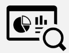

<p align="center">
  <a href="https://github.com/phampe68/StockTracker">
    
  </a>

  <h3 align="center">Stock Viewer</h3>

  <p align="center">
    A simple stock viewer.
    <br />
    <a href="https://github.com/phampe68/StockTracker">View Demo</a>
    ·
    <a href="https://github.com/phampe68/StockTracker/issues">Report Bug</a>
    ·
    <a href="https://github.com/phampe68/StockTracker/issues">Request Feature</a>
  </p>
</p>

<!-- TABLE OF CONTENTS -->
<details open="open">
  <summary>Table of Contents</summary>
  <ol>
    <li>
      <a href="#about-the-project">About The Project</a>
      <ul>
        <li><a href="#built-with">Built With</a></li>
      </ul>
    </li>
    <li>
      <a href="#getting-started">Getting Started</a>
      <ul>
        <li><a href="#prerequisites">Prerequisites</a></li>
        <li><a href="#installation">Installation</a></li>
      </ul>
    </li>
    <li><a href="#usage">Usage</a></li>
    <li><a href="#contact">Contact</a></li>
    <li><a href="#acknowledgements">Acknowledgements</a></li>
  </ol>
</details>

<!-- ABOUT THE PROJECT -->

## About The Project (Background)

 <br>
The goal of this project is to create an app where a user can search stocks and view their time series in different intervals (day, week, month). This app will have a user system which will allows users to add/remove stocks to a watchlist. The watchlists and users will be stored in a nosql database.

This project will demonstrate the ability to interact with an API, have a user management system, and perform basic operations on a noSQL database. Additionally, it makes use of several react native libraries that enhance the functionality and design of the program.

-   The api will be the alphavantage api.
-   The database will be using firebase
-   The overall App will be created using react-native

## Design Requirements

1. The user should begin at a sign in page where they can either login or be redirected to a sign up page. User accounts can be made using an email and password. If login is successful, the user should be redirected to the home page.
2. When the user signs up, a new account should be created using Firebase Auth's createUserWithEmailAndPassword API. Each user should have a user id, email, and password. If the sign up is successful, the user should be redirected to the home page.
3. The user should be able to navigate between a home screen where their stock watchlist is displayed, and a search screen where they can search and add stocks to the watchlist. Navigation should be done using side menu.
4. On the search screen, search results should be updated automatically as the user types. This can be done using the Alphavantage Search endpoint. Search results should appear on a flatlist.
5. Each search item should display the stock symbol and name.
6. When the user clicks on a search item, a modal should appear with a line chart that displays the monthly values of that stock over the past 10 months.
7. The user should be able to change the line chart such that they can view stock values by day, month, or year.
8. From the stock modal, the user should be able to add the stock to their watchlist if it's not already there. Adding to the watchlist should add an entry into a "watchlist' collection of the database with the fields 'userID' for the use that added the stock, and 'symbol' for the stock that was added.
9. On the home screen, the user should be able to view all the stocks on their watchlist. This can be implemented similarly to the search page. To get all of this user's stocks, we can filter the 'watchlist' collection for items with that match the user's userID.
10. The user should be able to remove stocks from their watchlist on the home screen. This can be done by swiping the list item which reveals a remove button.

### Built With

-   [React Native](https://reactnative.dev/)
-   [Firebase](https://firebase.google.com/)
-   See `package.json` for full list of dependencies.

<!-- GETTING STARTED -->

## Getting Started

To get a local copy up and running follow these simple example steps.
(See published app here: https://expo.io/@phampe68/projects/StockViewer)
### Prerequisites

If you don't have npm and node installed use this [link](https://nodejs.org/en/)

-   npm

    ```sh
    npm install npm@latest -g
    ```

-   expo

    ```sh
    npm install --global expo-cli
    ```

-   if you want to use a physical device, install [Expo Go App](https://play.google.com/store/apps/details?id=host.exp.exponent)

### Installation

1. Get a free API Key at [https://www.alphavantage.co/support/#api-key](https://www.alphavantage.co/support/#api-key)
2. Clone the repo
    ```sh
    git clone https://github.com/phampe68/StockTracker.git
    ```
3. Install NPM packages
    ```sh
    npm install
    ```
4. Enter your API in `api_config.json` (I've kept the one I've been using in this submission so you can use that one if you like)

    ```JS
        "key": "API KEY",
    ```

5. Run Expo Start
    ```sh
    expo start
    ```
6. Scan the generated QR code on expo go or run on an emulator.

<!-- CONTACT -->

## Contact

Peter Pham -  Peterpham68@gmail.com

<!-- ACKNOWLEDGEMENTS -->

## Acknowledgements

-   [Firebase React Native Login System Tutorial](https://www.freecodecamp.org/news/react-native-firebase-tutorial/)
-   [App color scheme picker](https://coolors.co/palettes/trending)
-   [Alphavantage Docs](https://www.alphavantage.co/documentation/)
-   [React Native Line Chart Kit](https://github.com/indiespirit/react-native-chart-kit/blob/master/src/line-chart/LineChart.tsx)
